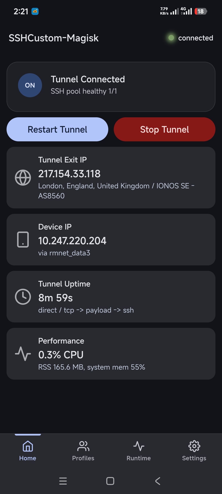
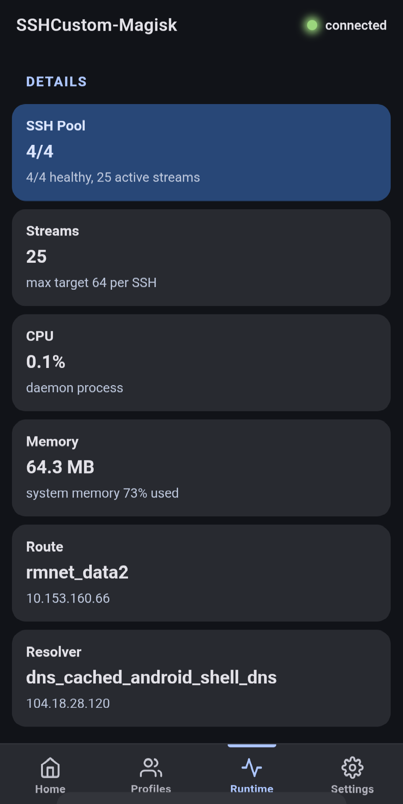
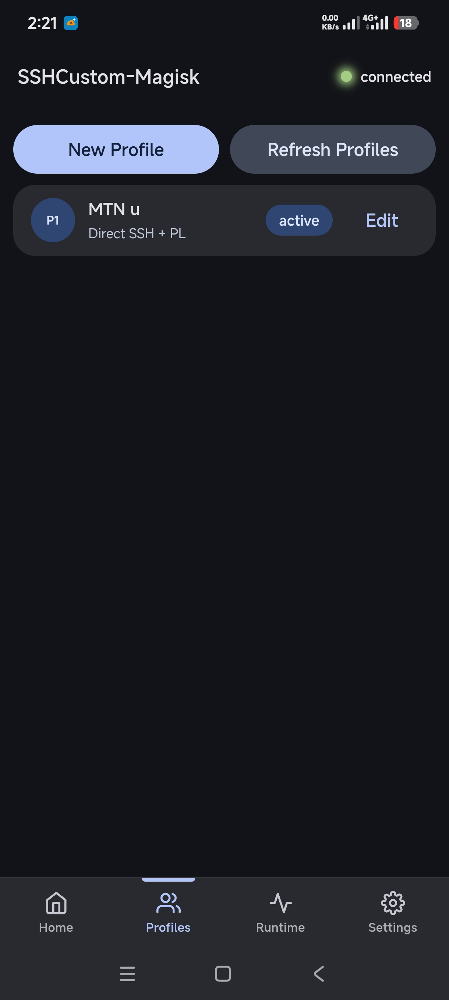
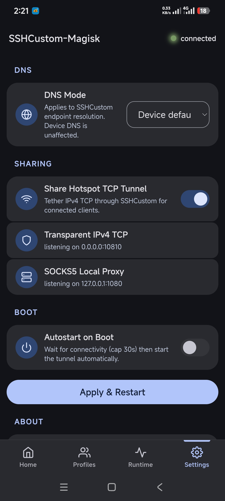

# SSHCustom-Magisk

Magisk / KernelSU module that routes Android TCP traffic through an SSH tunnel with transparent proxying.

[](https://github.com/GoodyOG/SSHCustom-Magisk/actions/workflows/build.yml)
[](LICENSE)
[](https://github.com/GoodyOG/SSHCustom-Magisk/releases/latest)

## Screenshots

<p align="center">
  
  
  
  
</p>

## Features

- **SSH connection pool** — 4 parallel SSH sessions for faster throughput and resilience
- **SOCKS5 proxy** + transparent TCP listener with iptables redirect
- **Pluggable transport** — direct SSH, HTTP proxy, TLS/SNI, payload injection
- **Hotspot tethering** — shares the tunnel with connected clients
- **Local dashboard** at `http://127.0.0.1:9190/` with real-time updates
- **Autostart on boot** with connectivity-aware delay
- **Real-time status** via Server-Sent Events + polling

Runs on rooted Android (Magisk or KernelSU), `arm64-v8a` and `armeabi-v7a`.

## Install

1. Download `SSHCustom-Magisk-vX.Y.Z.zip` from [Releases](https://github.com/GoodyOG/SSHCustom-Magisk/releases/latest).
2. Flash the ZIP via Magisk/KernelSU, reboot.
3. Tap the module action button to start.
4. Open `http://127.0.0.1:9190/` in your browser (or via KSU-Next's module WebUI) to manage profiles.
5. Save a profile with **Save, Use & Restart** to connect.

## Build from source

Requires Go 1.23+ and Python 3:

```bash
./build.sh
```

Output: `dist/SSHCustom-Magisk-v*.zip`

## API

REST + SSE on `127.0.0.1:9190`. Full spec in [`docs/openapi.yaml`](docs/openapi.yaml).

## Versioning

Single source of truth in [`VERSION`](VERSION). Bump it and push a `v*` tag — CI handles the rest.

## License

Licensed under the [Apache License 2.0](LICENSE).

## Credits

Built by **GoodyOG**.
